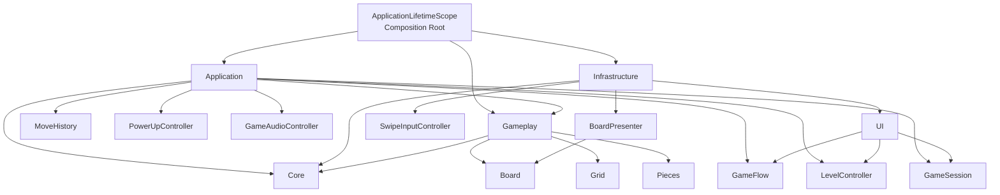
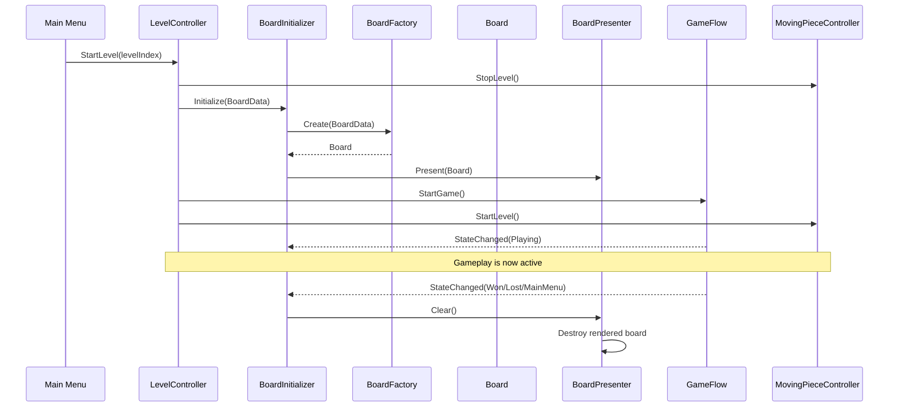

# System Architecture

## Overview

The project is structured around a decoupled gameplay model, application-level orchestration, and Unity presentation.

The logical board state is independent from its visual representation. Gameplay systems operate on the board model and communicate through events where appropriate. Unity-specific presentation, input, UI, and audio remain outside the core board logic.

## Architecture



## Main Responsibilities

### Core

Contains the platform-independent logical concepts used by the game.

- Grid
- GridPosition
- GridSize
- GridCell
- Board
- Piece
- Move
- CellType
- CellOccupant
- PieceType
- Gameplay events

The Core layer does not depend on Unity presentation objects.

### Gameplay

Contains the game-domain behavior operating on the board model.

- Player movement
- Moving obstacles
- Board creation and manipulation
- Gameplay rules

Gameplay logic works with the logical board rather than directly manipulating UI elements.

### Application

Coordinates complete game features and application-level lifecycle.

- GameFlow
- LevelController
- GameSession
- MoveHistory
- PowerUpController
- Audio orchestration
- Application entry points

Application systems use dependency injection through VContainer.

### Infrastructure

Contains Unity-facing presentation and interaction.

- BoardPresenter
- SwipeInputController
- Gameplay UI
- Main Menu UI
- Result UI
- Unity-specific presentation

Infrastructure is responsible for displaying state rather than owning the logical gameplay state.

## Level Lifecycle



## Dependency Direction

The project follows a dependency direction where higher-level application systems coordinate lower-level gameplay/data systems, while Unity presentation remains responsible for rendering and interaction.

```text
Application
    ↓
Gameplay / Core

Infrastructure
    ↓
Core
```

The composition root is responsible for connecting concrete implementations through VContainer.

## Dependency Injection

VContainer is used as the composition mechanism.

Runtime systems are registered through the application lifetime scope and receive their dependencies through constructor or framework injection.

This avoids service locators and global gameplay singletons.

## Event Communication

MessagePipe is used where systems need to communicate without creating direct dependencies between the sender and receiver.

Examples include:

- Player movement
- Undo requests
- Goal reached
- Player death
- Power-up targeting
- Power-up lifecycle
- Gameplay audio events

This allows UI and audio systems to react to gameplay without being embedded inside the gameplay logic.
