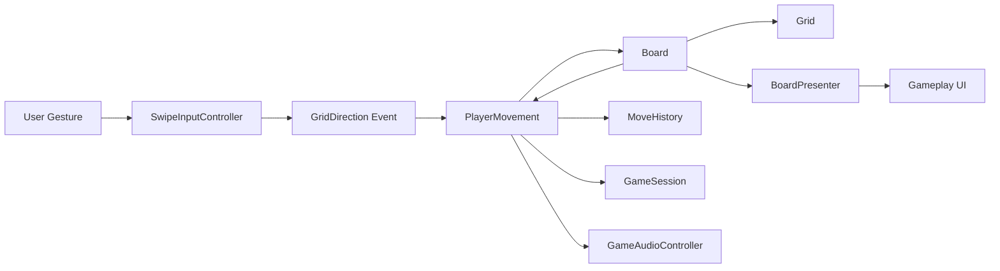
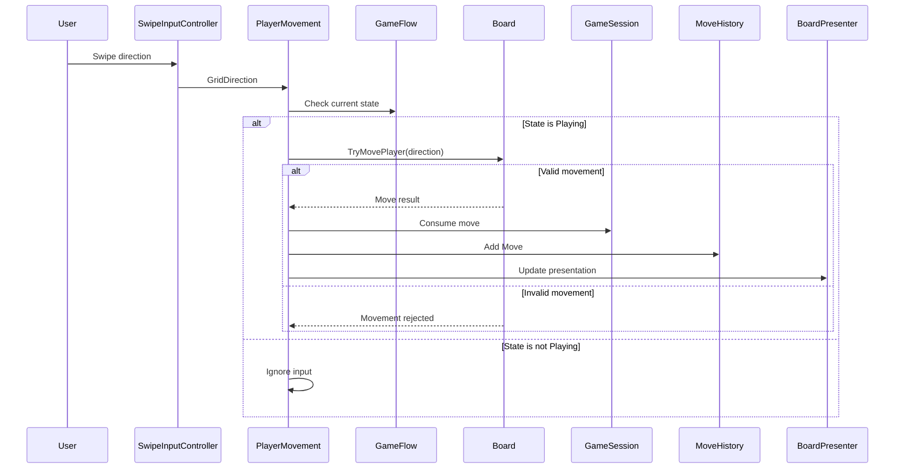
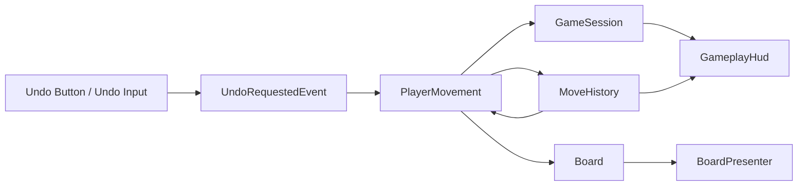
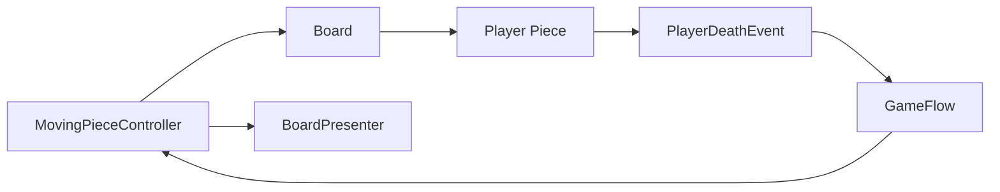
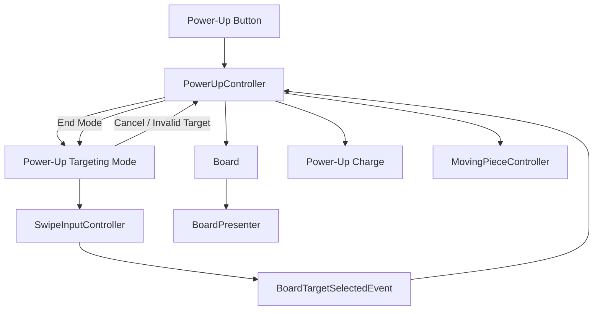
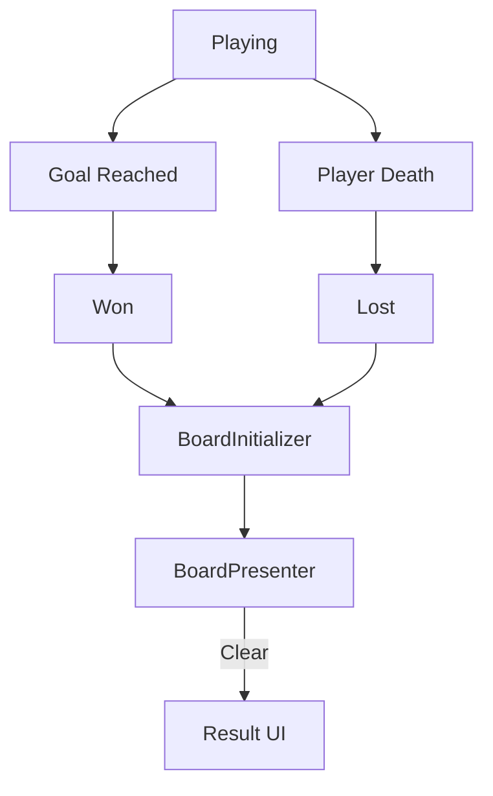
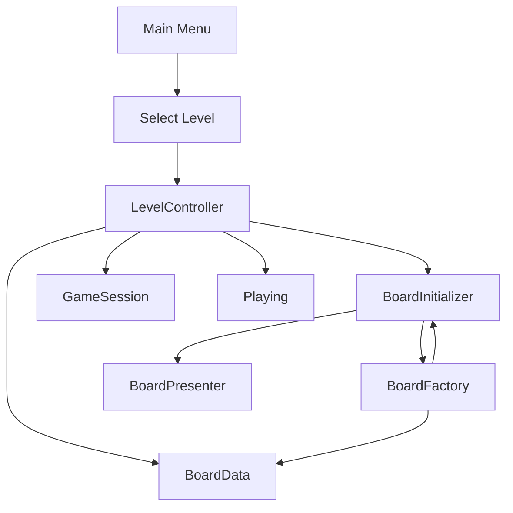

# Functional Data Flow

## Overview

The gameplay pipeline follows the assignment's required flow:

```text
User Gesture
    ↓
Input Controller
    ↓
Grid Matrix Update
    ↓
UI Rendering Framework
```

The implementation expands this flow with game-state validation, history tracking, UI updates, audio events, and gameplay feedback.

## Main Gameplay Flow



## Player Movement



## Invalid Movement

Invalid movement does not create a history entry and does not consume a move.

```text
Swipe
  ↓
PlayerMovement
  ↓
Board.TryMovePlayer()
  ↓
Invalid
  ↓
No board transition
  ↓
No MoveHistory entry
  ↓
No move consumed
```

## Undo Flow



Undo restores the previous normal player movement.

Power-up actions are not added to `MoveHistory`, so using Undo does not restore power-up charges or reverse a previously used power-up.

## Moving Obstacle Flow



Moving obstacles stop when gameplay is no longer active.

## Power-Up Flow



### Hammer

```text
Activate Hammer
    ↓
Enter targeting mode
    ↓
Select obstacle
    ↓
Validate target
    ↓
Remove obstacle from logical board
    ↓
Hide existing obstacle visual
    ↓
Consume Hammer charge
    ↓
End targeting mode
```

### Rocket

```text
Activate Rocket
    ↓
Enter targeting mode
    ↓
Select Stone
    ↓
Validate target
    ↓
Change Stone cell to Normal
    ↓
Update presentation
    ↓
Consume Rocket charge
    ↓
End targeting mode
```

Power-up actions are not normal movement actions and are not recorded in `MoveHistory`.

## Win / Loss Flow



When `GameFlow` leaves `Playing`, the rendered board is cleared.

The logical level lifecycle is then controlled by `LevelController`, which can start the next level, retry the current level, or return to the Main Menu.

## Level Selection Flow



Each level provides its own board configuration and move limit through `BoardData`.

## Overall Runtime Flow

```text
Main Menu
    ↓
Level Selection
    ↓
LevelController
    ↓
BoardData
    ↓
BoardFactory
    ↓
Logical Board
    ↓
BoardPresenter
    ↓
Gameplay

Gameplay
    ↓
User Input
    ↓
Input Controller
    ↓
Gameplay System
    ↓
Board / Grid
    ↓
Game State
    ├── Move History
    ├── Remaining Moves
    ├── UI
    └── Audio

Gameplay
    ├── Goal → Won
    └── Death / Move Limit → Lost

Won / Lost / Main Menu
    ↓
BoardPresenter.Clear()
    ↓
Rendered Board Removed
```
